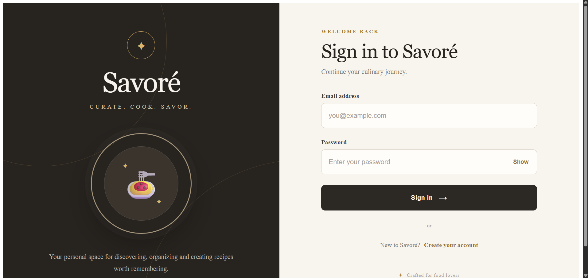
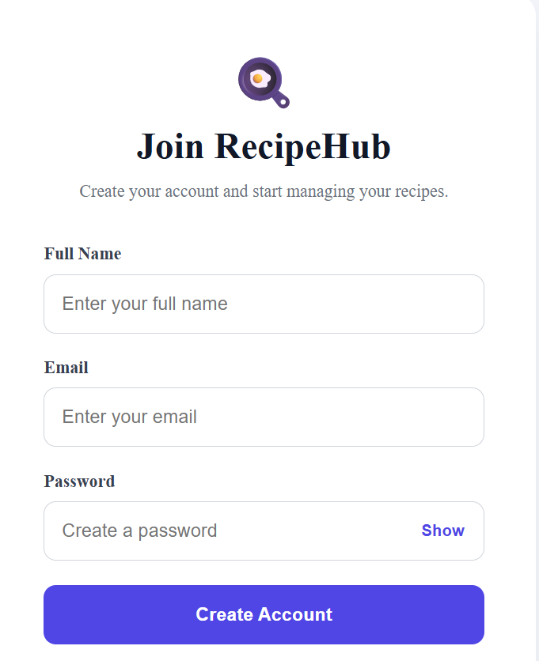
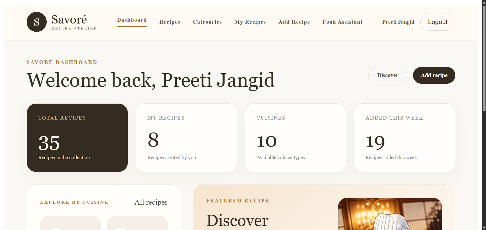
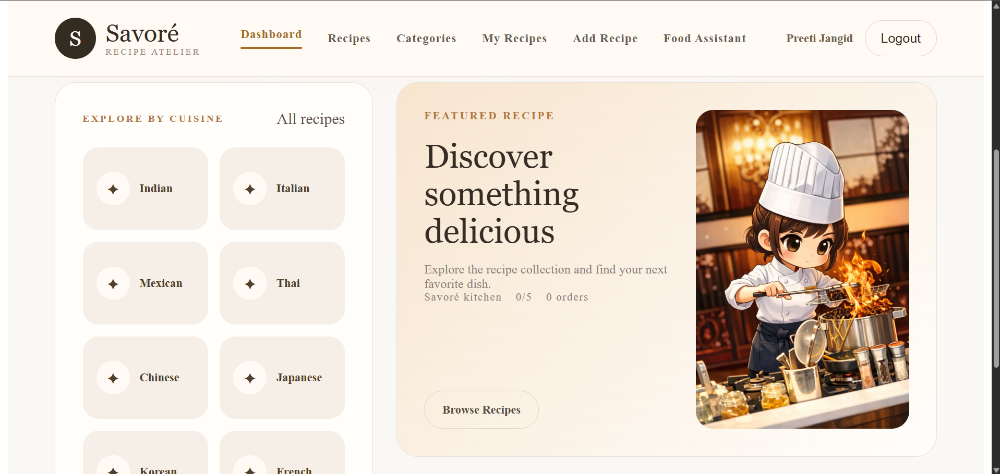
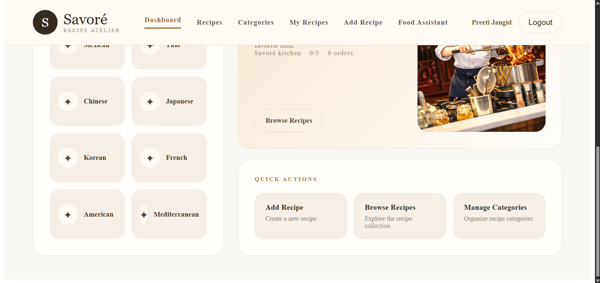
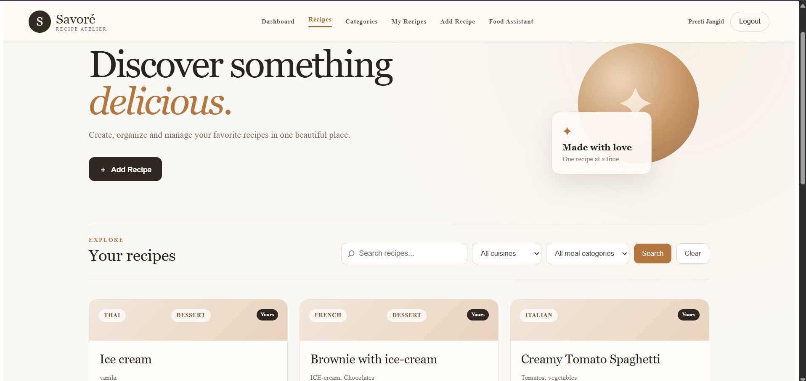
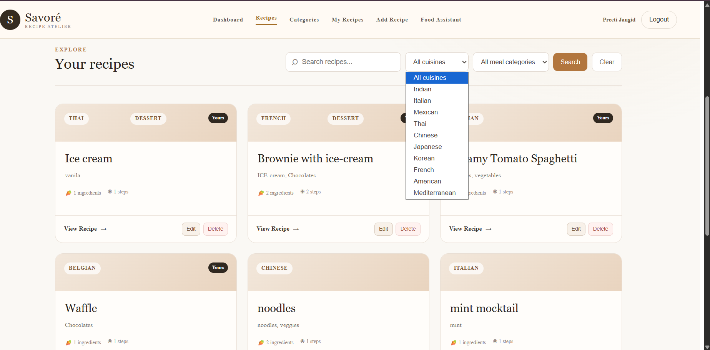
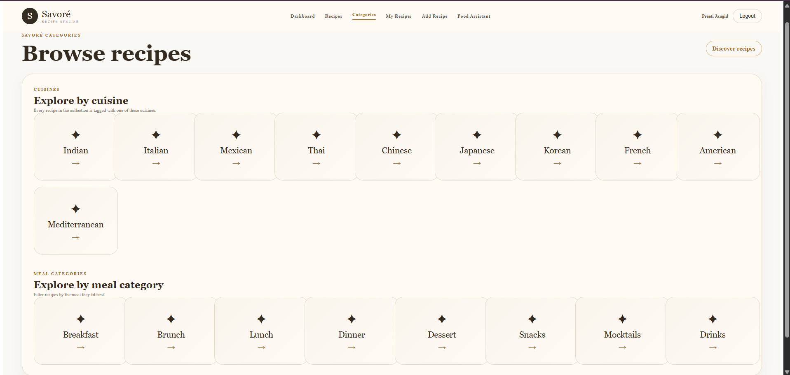
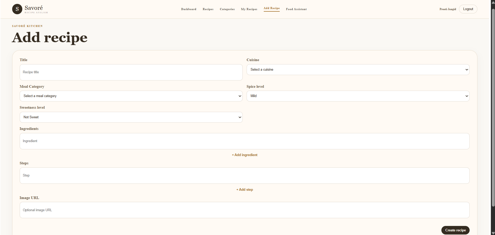
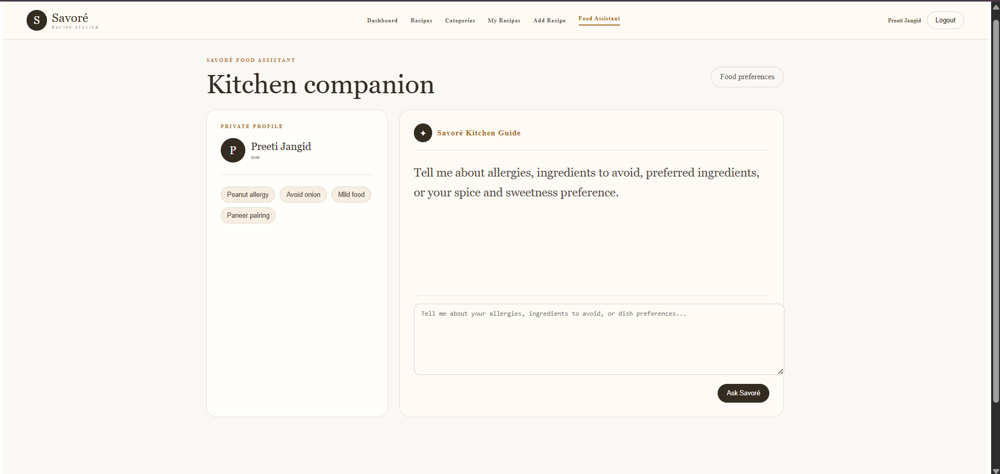

# Savoré — Recipe Management App

Savoré is a full-stack Recipe Management Application that allows users to discover, create, manage, and organize recipes through a clean and responsive web interface.

The application provides secure authentication, recipe CRUD operations, search and filtering, cuisine and meal category based discovery, authorization, recipe ratings, recipe ordering, and a food assistant.

---

## ✨ Features

### Authentication & Authorization

* User registration and login
* Password hashing with bcrypt
* JWT-based authentication
* Protected routes
* Automatic authentication handling
* User logout
* Role-based authorization
* Recipe ownership protection
* Owner can edit and delete their own recipes
* Different users cannot modify another user's recipes
* Proper 401 and 403 authorization handling

### Recipe Management

* Create recipes
* View recipes
* View recipe details
* Edit own recipes
* Delete own recipes
* Ingredients and preparation steps
* Spice level
* Sweetness level
* Recipe images
* Recipe ratings
* Recipe order count

### Recipe Discovery

* Browse all recipes
* Search recipes
* Filter recipes by cuisine
* Filter recipes by meal category
* Combine cuisine and meal category filters
* Pagination
* Sorting
* Recipe detail pages

### Categories

#### Cuisines

* Indian
* Italian
* Mexican
* Thai
* Chinese
* Japanese
* Korean
* French
* American
* Mediterranean

#### Meal Categories

* Breakfast
* Brunch
* Lunch
* Dinner
* Dessert
* Snacks
* Mocktails
* Drinks

### Dashboard

* Total recipes
* My recipes
* Available categories
* Recipes added this week
* Explore by category
* Featured recipe
* Quick actions

### Food Assistant

* Recipe preference based assistance
* Recipe matching
* Food preference management

### User Experience

* Responsive design
* Mobile-friendly layout
* Loading states
* Error states
* Empty states
* Clean Savoré visual design
* Protected navigation
* 404 page
* Angular Material

---

## 🛠️ Tech Stack

### Frontend

* Angular
* TypeScript
* RxJS
* Angular Router
* Angular HttpClient
* Angular Material
* HTML5
* CSS3

### Backend

* Node.js
* Express.js
* MongoDB
* Mongoose
* JWT
* bcrypt
* express-validator
* Helmet
* CORS
* express-rate-limit

### Testing

* Jest
* Supertest
* Angular testing tools

### Database & Deployment

* MongoDB Atlas
* Render

---

## 📁 Project Structure

```text
final-recipe-management-app/
│
├── client/
│   └── recipe-client/
│       ├── src/
│       │   └── app/
│       ├── public/
│       │   └── images/
│       ├── package.json
│       └── angular.json
│
├── server/
│   ├── config/
│   ├── controllers/
│   ├── middleware/
│   ├── models/
│   ├── routes/
│   ├── tests/
│   ├── server.js
│   └── package.json
│
├── docs/
│   └── screenshots/
│       ├── addrecipe.png
│       ├── assistant.png
│       ├── categories.png
│       ├── dashboard.png
│       ├── dashboard1.png
│       ├── dashboard2.png
│       ├── login.png
│       ├── recipes.png
│       ├── recipes1.png
│       └── regestration.png
│
└── README.md
```

---

## 🚀 Live Demo

### Frontend

https://savore-fnph.onrender.com

### Backend API

https://savore-lz8a.onrender.com

---

## ⚙️ Getting Started

### Prerequisites

Make sure the following are installed:

* Node.js
* npm
* MongoDB Atlas account
* Angular CLI

### Clone the repository

```bash
git clone https://github.com/preetijangid-hub/final-recipe-management-app.git
cd final-recipe-management-app
```

---

## 🔧 Backend Setup

```bash
cd server
npm install
npm start
```

The backend runs on:

```text
http://localhost:5000
```

### Environment Variables

Create a `.env` file inside the `server` folder:

```env
MONGODB_URI=your_mongodb_connection_string
JWT_SECRET=your_jwt_secret
PORT=5000
CLIENT_URL=http://localhost:4200
```

---

## 💻 Frontend Setup

Open another terminal:

```bash
cd client/recipe-client
npm install
ng serve
```

The Angular application runs on:

```text
http://localhost:4200
```

---

## 🔗 API Overview

### Authentication

```text
/api/auth
```

Includes:

* User registration
* User login
* Current user information

### Recipes

```text
/api/recipes
```

Includes:

* Recipe listing
* Recipe creation
* Recipe details
* Recipe update
* Recipe deletion
* Recipe ratings
* Recipe ordering
* Recipe compatibility
* Recipe statistics

### Categories

```text
/api/categories
```

Provides cuisine and meal category information.

### Food Assistant

```text
/api/assistant
```

Provides recipe and food preference assistance.

---

## 🧪 Testing

Backend tests can be run from the `server` directory using the configured Jest test setup.

```bash
cd server
npm test
```

---

## 📸 Screenshots

### Login



### Registration



### Dashboard



### Dashboard — View 2



### Dashboard — View 3



### Recipes



### Recipes — View 2



### Categories



### Add Recipe



### Food Assistant



---

## 🔐 Security

The application includes:

* JWT authentication
* Password hashing using bcrypt
* Protected API routes
* Role-based authorization
* Recipe ownership checks
* Request validation
* Helmet security headers
* CORS configuration
* Rate limiting

---

## 🗄️ Database

Savoré uses MongoDB Atlas with Mongoose for database management.

The main data models include:

* User
* Recipe

---

## ☁️ Deployment

The application is deployed using Render.

### Frontend

```text
https://savore-fnph.onrender.com
```

### Backend

```text
https://savore-lz8a.onrender.com
```

---

## 👩‍💻 Developer

**Preeti Jangid**

B.Tech Computer Science & Engineering

GitHub:
https://github.com/preetijangid-hub

---

## 🎯 Project Goals

Savoré was developed as a full-stack application to demonstrate practical experience with:

* Angular frontend development
* REST API development
* Node.js and Express
* MongoDB and Mongoose
* JWT authentication
* Authorization
* API validation
* Testing
* Responsive UI development
* Full-stack deployment
